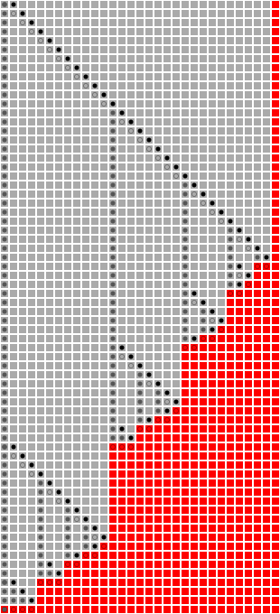

# TreeverseAlgorithm

[](https://github.com/GiggleLiu/TreeverseAlgorithm.jl/actions)


Treeverse algorithm described in

[Achieving logarithmic growth of temporal and spatial complexity in reverse automatic differentiation](https://www.tandfonline.com/doi/abs/10.1080/10556789208805505), 1992, By Andreas Griewank

This is one of the corner stone of automatic differentiation towards solving the memory wall issue.

```julia
julia> using TreeverseAlgorithm

julia> using Viznet
┌ Info: TreeverseAlgorithm: You just imported `Viznet`, you can use
└     * (image, nstep) = treeverse_pebblegame(N, δ)

julia> treeverse_pebblegame(30, 5)[1]
Treeverse peak memory = 6
```



For an example, please checkout the [test file](test/treeverse.jl)
